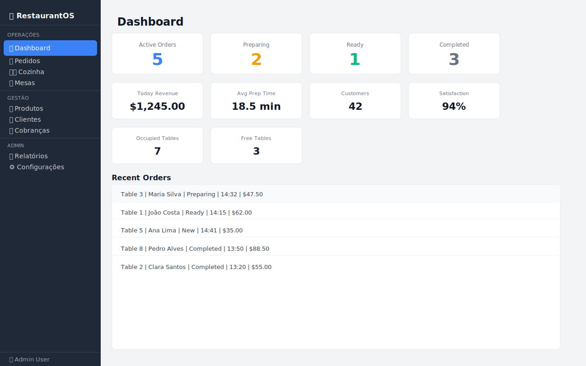

# 01 — Primeiros Passos

Guia de instalação, requisitos e primeiro acesso ao RestaurantOS.

---

## Requisitos do Sistema

| Componente | Requisito Mínimo |
|------------|-----------------|
| **Java** | Java 21 LTS (ou superior) |
| **Sistema Operacional** | Windows 10+, macOS 12+, Linux (Ubuntu 20.04+) |
| **RAM** | 512 MB (recomendado: 1 GB) |
| **Espaço em disco** | ~200 MB |
| **Resolução de tela** | 1280×800 ou superior |

> **Como verificar a versão do Java:**
> ```bash
> java -version
> # Saída esperada: java version "21.x.x" ...
> ```

---

## Instalação

### 1. Obtenha o Java 21

Caso não tenha o Java 21 instalado, baixe o **Eclipse Temurin 21 (LTS)** em:

🔗 https://adoptium.net/temurin/releases/?version=21

Ou via gerenciador de pacotes:

```bash
# Ubuntu / Debian
sudo apt install temurin-21-jdk

# macOS (Homebrew)
brew install --cask temurin@21

# Windows (Chocolatey)
choco install temurin21
```

### 2. Clone ou baixe o repositório

```bash
git clone https://github.com/OZimbres/figma-ai-OMS.git
cd figma-ai-OMS
```

Ou faça o download do arquivo ZIP pela página do repositório no GitHub e descompacte.

### 3. Compile o projeto

```bash
./gradlew build
```

> No Windows, use `gradlew.bat build` em vez de `./gradlew build`.

Saída esperada ao final:
```
BUILD SUCCESSFUL in Xs
```

---

## Executando a Aplicação

```bash
./gradlew run
```

A janela principal do RestaurantOS será aberta:



---

## Estrutura da Interface

A interface é composta por dois elementos principais:

### Barra Lateral (Sidebar)
Localizada à esquerda, agrupa a navegação em três seções:

```
┌─────────────────────┐
│  Café com Prosa     │
├─────────────────────┤
│  OPERATIONS         │
│  📊 Dashboard       │
│  📋 Orders          │
│  👨‍🍳 Kitchen         │
│  🪑 Tables          │
├─────────────────────┤
│  MANAGEMENT         │
│  🍽 Products        │
│  👥 Clients         │
│  💰 Bills           │
├─────────────────────┤
│  ADMIN              │
│  📈 Reports         │
│  ⚙️ Settings        │
├─────────────────────┤
│  👤 Admin User      │
└─────────────────────┘
```

### Área de Conteúdo
Ocupa o restante da tela. Cada clique no menu lateral carrega a tela correspondente nesta área. Todas as telas possuem scroll automático quando o conteúdo excede a altura disponível.

---

## Dados de Demonstração

O sistema inicia com **dados de demonstração pré-carregados** para facilitar os testes:

- 🪑 **10 mesas** com diferentes status
- 📋 **7 pedidos** em vários estágios
- 🍽️ **22 produtos** no cardápio
- 👥 **10 clientes** cadastrados
- 💰 **7 cobranças** (pagas e pendentes)

Esses dados são gerados em memória ao iniciar a aplicação e são redefinidos a cada reinicialização.

> ⚠️ **Nota:** O RestaurantOS utiliza armazenamento em memória. Todos os dados são perdidos ao fechar a aplicação. Para produção, uma integração com banco de dados persistente seria necessária.

---

## Próximos Passos

Agora que o sistema está rodando, consulte os guias de cada módulo:

- 📊 [Dashboard](02-dashboard.md) — Entenda os indicadores principais
- 📋 [Pedidos](03-orders.md) — Como criar e gerenciar pedidos
- 👨‍🍳 [Fila da Cozinha](04-kitchen-queue.md) — Kanban de preparo
- 🪑 [Mesas](05-tables.md) — Controle de ocupação
- 🍽️ [Produtos](06-products.md) — Configurar o cardápio
- 👥 [Clientes](07-clients.md) — Gerenciar clientes
- 💰 [Cobranças](08-bills.md) — Processar pagamentos
- 📈 [Relatórios](09-reports.md) — Analytics
- ⚙️ [Configurações](10-settings.md) — Parâmetros do sistema

---

*[← Voltar ao Índice](../index.md)*
