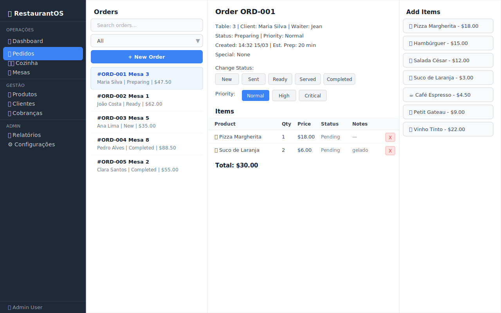
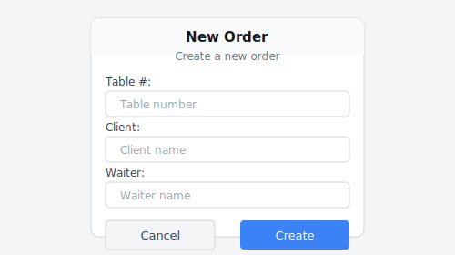

# 03 — Pedidos (Orders)

O módulo de Pedidos é o coração operacional do RestaurantOS. Aqui os garçons criam, acompanham e gerenciam todos os pedidos do restaurante.

---

## Visão Geral



A tela é dividida em **três painéis**:

```
┌──────────────┬────────────────────────┬────────────────┐
│ Lista de     │  Detalhes do Pedido    │  Adicionar     │
│ Pedidos      │  Selecionado           │  Produtos      │
│ (esquerda)   │  (centro)              │  (direita)     │
└──────────────┴────────────────────────┴────────────────┘
```

---

## Painel Esquerdo — Lista de Pedidos

### Busca e Filtros

**Campo de busca:**
- Filtra pedidos por nome do cliente, ID do pedido ou número da mesa
- A lista atualiza automaticamente a cada caractere digitado

**Filtro de status:**
Dropdown com as opções: `All | New | Preparing | Ready | Served | Completed`

### Lista de Pedidos

Cada item na lista exibe:
```
#ORD-001  Mesa 3
Maria Silva  |  Preparing  |  $47.50
```

Clique em qualquer pedido para ver seus detalhes no painel central.

### Botão "New Order"

Clique em **+ New Order** para abrir o dialog de criação de pedido.

---

## Criando um Novo Pedido

1. Clique em **+ New Order**
2. Preencha o formulário:

| Campo | Descrição | Obrigatório |
|-------|-----------|:-----------:|
| Table # | Número da mesa | ✅ |
| Client | Nome do cliente | ✅ |
| Waiter | Nome do garçom | ✅ |
| Special | Instruções especiais (ex.: "sem glúten") | ❌ |

3. Clique em **Create**

O pedido é criado com status **Novo** e aparece automaticamente na lista.



---

## Painel Central — Detalhes do Pedido

Ao selecionar um pedido, o painel central exibe:

### Informações do Pedido
```
Order ORD-001
Table: 3  |  Client: Maria Silva  |  Waiter: Jean
Status: Preparing  |  Priority: Normal
Created: 14:32 15/03  |  Est. Prep: 20 min
Special: None
```

### Alterar Status

Botões de ação exibem todos os status disponíveis, exceto o atual:

```
[ New ] [ Sent ] [ Preparing ] [ Ready ] [ Served ] [ Completed ]
```

Clique no status desejado para atualizar imediatamente.

### Definir Prioridade

```
Priority:  [ Normal ]  [ High ]  [ Critical ]
```

O botão do status atual fica em destaque. Pedidos críticos aparecem em vermelho na [Fila da Cozinha](04-kitchen-queue.md).

### Tabela de Itens

| Produto | Qty | Preço | Status | Notas | |
|---------|-----|-------|--------|-------|---|
| 🍕 Pizza Margherita | 1 | $18.00 | Pending | - | X |
| 🥤 Suco de Laranja | 2 | $6.00 | Pending | gelado | X |

**Total: $30.00**

O botão **X** em cada linha remove o item do pedido.

---

## Painel Direito — Adicionar Produtos

Exibe todos os produtos **disponíveis** do cardápio.

```
Adicionar Items
─────────────────
🍕 Pizza Margherita - $18.00
🍔 Hambúrguer Classic - $15.00
🥗 Salada César - $12.00
🥤 Suco de Laranja - $3.00
☕ Café Espresso - $4.50
...
```

**Como adicionar um produto ao pedido:**
1. Selecione um pedido na lista esquerda
2. Clique no produto desejado no painel direito
3. O produto é adicionado com quantidade 1 ao pedido

> Para alterar a quantidade ou adicionar notas a um item, edite diretamente na tabela de itens (coluna Status/Notes é editável).

---

## Fluxo Completo de um Pedido

```
1. Garçom cria pedido        → Status: New
2. Garçom envia para cozinha → Status: Sent
3. Cozinha inicia preparo    → Status: Preparing  ← visível na Kitchen Queue
4. Prato fica pronto         → Status: Ready       ← alerta para o garçom
5. Garçom serve o prato      → Status: Served
6. Pedido finalizado         → Status: Completed   ← cobrança é gerada
```

---

## Dicas de Uso

- 💡 Use o campo de busca para localizar rapidamente pedidos de uma mesa específica
- 💡 Pedidos com prioridade **Crítica** aparecem em vermelho na cozinha — use com moderação
- 💡 Adicione instruções especiais ao criar o pedido (ex: "alergia a amendoim") — aparecem na cozinha
- 💡 Você pode adicionar itens ao pedido em qualquer momento antes de concluí-lo

---

## 🎥 Vídeo Demonstrativo

📹 [Assista: Criando e gerenciando pedidos](../media/videos/03-orders.md)

---

*[← Dashboard](02-dashboard.md) | [Fila da Cozinha →](04-kitchen-queue.md)*  
*[← Voltar ao Índice](../index.md)*
