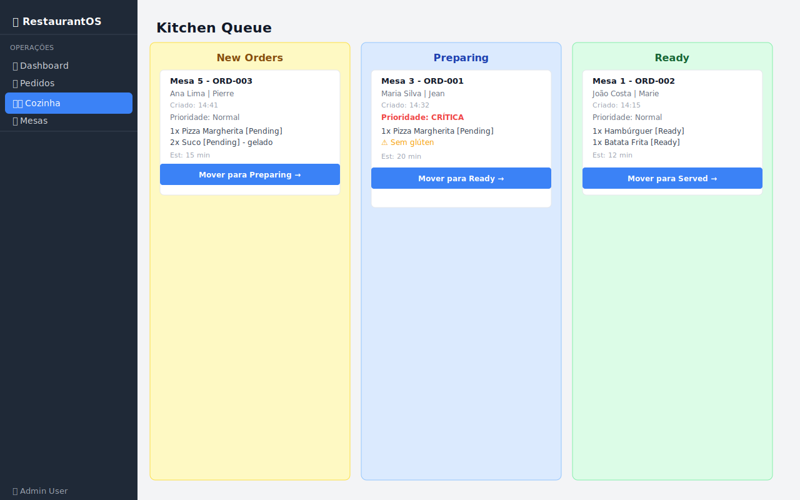

# 04 — Fila da Cozinha (Kitchen Queue)

A Fila da Cozinha é o painel de controle da equipe de cozinha. Utiliza uma visualização **Kanban** para acompanhar o ciclo de preparo dos pedidos.

---

## Visão Geral



---

## Layout Kanban — 3 Colunas

A tela é dividida em três colunas, cada uma representando um estágio do preparo:

```
┌─────────────────┬─────────────────┬─────────────────┐
│   New Orders    │    Preparing    │      Ready      │
│  (Novos)        │  (Em Preparo)   │  (Prontos)      │
│─────────────────│─────────────────│─────────────────│
│ [Cartão pedido] │ [Cartão pedido] │ [Cartão pedido] │
│ [Cartão pedido] │                 │ [Cartão pedido] │
│                 │                 │                 │
└─────────────────┴─────────────────┴─────────────────┘
```

| Coluna | Status dos Pedidos | Ação do Botão |
|--------|--------------------|---------------|
| **New Orders** | Novo, Enviado | → Mover para "Preparing" |
| **Preparing** | Em Preparo | → Mover para "Ready" |
| **Ready** | Pronto | → Mover para "Served" |

> Pedidos com status Servido e Concluído **não aparecem** na cozinha.

---

## Cartão de Pedido

Cada cartão exibe todas as informações necessárias para o preparo:

```
┌──────────────────────────────────────┐
│ Mesa 3  -  ORD-001                   │
│ Maria Silva  |  Jean (garçom)        │
│ Criado: 14:32                        │
│ Prioridade: ⚠️ CRÍTICA               │  ← vermelho se Crítica
│                                      │
│  1x Pizza Margherita [Pending]       │
│  2x Suco de Laranja [Pending] - gelado│
│  ⚠️ sem glúten                       │  ← instruções especiais
│                                      │
│ Est: 20 min                          │
│                                      │
│ [ Mover para Preparing →  ]          │
└──────────────────────────────────────┘
```

### Campos do Cartão

| Campo | Descrição |
|-------|-----------|
| **Mesa - ID** | Número da mesa e ID do pedido |
| **Cliente \| Garçom** | Nome do cliente e do garçom responsável |
| **Criado** | Horário de criação do pedido (formato HH:mm) |
| **Prioridade** | Normal, Alta (amarelo) ou Crítica (vermelho em negrito) |
| **Itens** | Lista com quantidade, produto, status do item e notas |
| **Instruções** | Alerta ⚠️ com instruções especiais em amarelo |
| **Est** | Tempo estimado de preparo em minutos |
| **Botão Mover** | Avança o pedido para o próximo estágio |

---

## Indicadores de Prioridade

| Prioridade | Cor do texto | Quando usar |
|------------|-------------|-------------|
| Normal | Cinza escuro | Pedidos regulares |
| Alta | 🟡 Amarelo/Âmbar | Pedidos com urgência moderada |
| Crítica | 🔴 Vermelho | Pedidos urgentes / VIP / reclamações |

> A prioridade é definida na tela de [Pedidos](03-orders.md) pelo garçom.

---

## Movendo um Pedido

1. Localize o pedido na coluna correspondente ao estágio atual
2. Clique no botão **"Mover para [próximo estágio] →"**
3. O cartão desaparece da coluna atual e aparece na próxima coluna

**Exemplo de fluxo na cozinha:**
```
[Nova Orders] → clique → [Preparing] → clique → [Ready]
                                                    ↓
                                           Garçom é notificado
```

---

## Atualização em Tempo Real

A Fila da Cozinha atualiza automaticamente quando:
- Um pedido tem seu status alterado (na tela de Pedidos ou na própria cozinha)
- Um novo pedido é criado
- Um pedido é concluído

Não é necessário recarregar a tela.

---

## Casos de Uso

### Início do serviço (cozinha)
1. Abra a tela **Kitchen Queue** em um tablet ou monitor da cozinha
2. Todos os pedidos novos aparecerão na coluna "New Orders"

### Durante o serviço
1. Ao iniciar o preparo de um pedido, clique em **"Mover para Preparing →"**
2. Quando o prato estiver pronto, clique em **"Mover para Ready →"**
3. O garçom verá o status "Pronto" na tela de Pedidos

### Pedidos urgentes
- Pedidos com prioridade **Crítica** são imediatamente identificáveis pelo texto vermelho
- Priorize esses pedidos na fila

---

## 🎥 Vídeo Demonstrativo

📹 [Assista: Kitchen Queue em ação](../media/videos/04-kitchen-queue.md)

---

*[← Pedidos](03-orders.md) | [Mesas →](05-tables.md)*  
*[← Voltar ao Índice](../index.md)*
