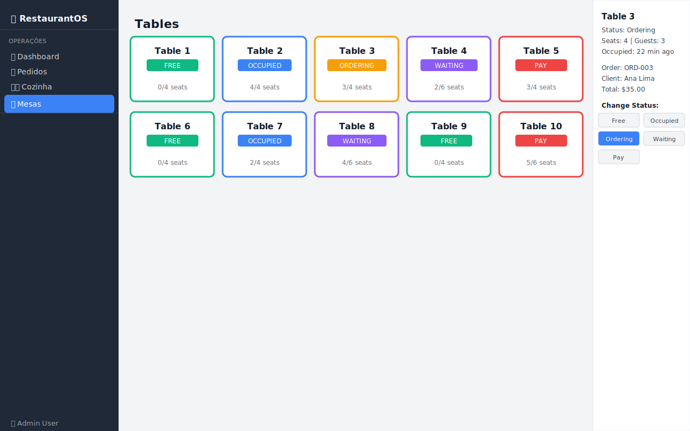

# 05 — Mesas (Tables)

O módulo de Mesas oferece uma visão visual em grade de todas as mesas do restaurante, com controle de status e detalhes de ocupação.

---

## Visão Geral



A tela é dividida em:
- **Grade de mesas** (área principal) — exibe todos os cartões de mesas
- **Painel lateral** (direita) — exibe detalhes da mesa selecionada

---

## Grade de Mesas

Cada mesa é representada por um cartão colorido:

```
┌─────────────────┐   ┌─────────────────┐   ┌─────────────────┐
│   Table 1       │   │   Table 2       │   │   Table 3       │
│  ┌──────────┐   │   │  ┌──────────┐   │   │  ┌──────────┐   │
│  │  FREE    │   │   │  │ OCCUPIED │   │   │  │ ORDERING │   │
│  └──────────┘   │   │  └──────────┘   │   │  └──────────┘   │
│   0/4 seats     │   │   3/4 seats     │   │   2/6 seats     │
└─────────────────┘   └─────────────────┘   └─────────────────┘
   (borda verde)          (borda azul)         (borda amarela)
```

### Legenda de Cores

| Status | Cor | Significado |
|--------|-----|-------------|
| **FREE** (Livre) | 🟢 Verde | Mesa disponível para novos clientes |
| **OCCUPIED** (Ocupada) | 🔵 Azul | Mesa com clientes sentados |
| **ORDERING** (Pedindo) | 🟡 Amarelo | Clientes fazendo o pedido |
| **WAITING** (Aguardando) | 🟣 Roxo | Aguardando comida |
| **PAY** (Pagamento) | 🔴 Vermelho | Aguardando a conta |

Cada cartão exibe:
- **Número da mesa** (ex: "Table 3")
- **Badge de status** com a cor correspondente
- **Ocupação** (convidados/total de assentos, ex: "3/4 seats")

---

## Painel de Detalhes

Clique em qualquer mesa para ver seus detalhes no painel lateral:

```
┌─────────────────────────────┐
│ Table 3                     │
│                             │
│ Status: Occupied            │
│ Seats: 4  |  Guests: 3      │
│ Occupied: 45 min ago        │
│                             │
│ Order: ORD-001              │
│ Client: Maria Silva         │
│ Total: $47.50               │
│                             │
│ Change Status:              │
│ [ Free ] [Occupied] [Order] │
│ [Waiting]   [Pay]           │
└─────────────────────────────┘
```

### Campos do Painel

| Campo | Descrição |
|-------|-----------|
| **Status** | Status atual da mesa |
| **Seats \| Guests** | Capacidade total e número atual de clientes |
| **Occupied** | Há quantos minutos a mesa está ocupada |
| **Order** | ID do pedido vinculado (se houver) |
| **Client** | Nome do cliente do pedido ativo |
| **Total** | Valor acumulado do pedido ativo |

---

## Alterando o Status de uma Mesa

1. Clique na mesa desejada na grade
2. No painel lateral, localize a seção **"Change Status:"**
3. Clique no botão do novo status desejado

> O botão do status atual aparece em **destaque** para facilitar a identificação.

### Fluxo típico de uma mesa

```
FREE → OCCUPIED → ORDERING → WAITING → PAY → FREE
```

| Transição | Quando ocorre |
|-----------|---------------|
| FREE → OCCUPIED | Cliente(s) se sentam |
| OCCUPIED → ORDERING | Clientes começam a pedir |
| ORDERING → WAITING | Pedido enviado à cozinha |
| WAITING → PAY | Clientes terminam e pedem a conta |
| PAY → FREE | Conta paga, mesa liberada |

---

## Dicas de Uso

- 💡 Use a tela de Mesas em um monitor no salão para o maître acompanhar a ocupação
- 💡 Mesas em vermelho (PAY) precisam de atenção imediata do caixa
- 💡 O contador "Occupied: X min ago" ajuda a identificar mesas com espera prolongada
- 💡 Combine com a tela de [Pedidos](03-orders.md) para gerenciar o status do pedido e da mesa em sincronia

---

## 🎥 Vídeo Demonstrativo

📹 [Assista: Gerenciamento de mesas](../media/videos/05-tables.md)

---

*[← Fila da Cozinha](04-kitchen-queue.md) | [Produtos →](06-products.md)*  
*[← Voltar ao Índice](../index.md)*
