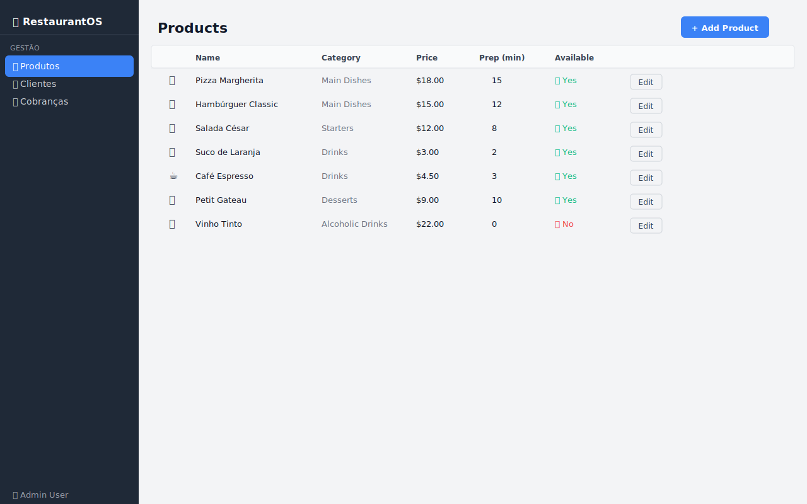
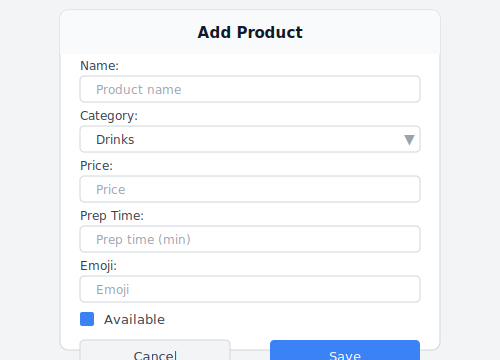

# 06 — Produtos (Products)

O módulo de Produtos permite gerenciar o cardápio completo do restaurante: adicionar novos itens, editar existentes e controlar a disponibilidade.

---

## Visão Geral



---

## Tabela de Produtos

A tabela exibe todos os produtos cadastrados com as seguintes colunas:

| Coluna | Descrição |
|--------|-----------|
| (emoji) | Ícone visual do produto |
| **Name** | Nome do produto |
| **Category** | Categoria do produto |
| **Price** | Preço de venda (ex: $18.00) |
| **Prep (min)** | Tempo estimado de preparo em minutos |
| **Available** | ✅ Sim (disponível no cardápio) ou ❌ Não |
| (botão) | Botão **Edit** para abrir o dialog de edição |

### Exemplo de linha

```
🍕  |  Margherita Pizza  |  Meals  |  $11.00  |  15  |  ✅ Yes  |  [Edit]
```

---

## Adicionando um Novo Produto

1. Clique no botão **+ Add Product** (topo direito)
2. Preencha o formulário:



| Campo | Descrição | Exemplo |
|-------|-----------|---------|
| **Name** | Nome do produto | "Margherita Pizza" |
| **Category** | Categoria no cardápio | `Meals` |
| **Price** | Preço em decimal | `11.00` |
| **Prep Time** | Tempo de preparo (minutos) | `15` |
| **Emoji** | Emoji representativo | `🍕` |
| **Available** | Checkbox de disponibilidade | ✅ marcado |

3. Clique em **Save**

---

## Editando um Produto

1. Localize o produto na tabela
2. Clique no botão **Edit** na linha correspondente
3. O dialog abre **pré-preenchido** com os dados atuais
4. Faça as alterações desejadas
5. Clique em **Save**

> As alterações são refletidas imediatamente em todas as telas que exibem produtos (incluindo o painel de adição de itens na tela de [Pedidos](03-orders.md)).

---

## Categorias Disponíveis

| Categoria | Descrição |
|-----------|-----------|
| **Drinks** | Bebidas (café, sucos, água) |
| **Pastries** | Pães e pastéis (croissants, muffins, rolls) |
| **Sandwiches** | Sanduíches e lanches |
| **Meals** | Pratos principais (saladas, massas, carnes, pizzas) |
| **Desserts** | Sobremesas |

---

## Controle de Disponibilidade

O campo **Available** controla se o produto aparece ou não na lista de itens para adição em pedidos:

- **✅ Available (marcado):** Produto aparece na lista de adição de itens em Pedidos
- **❌ Unavailable (desmarcado):** Produto ainda existe no cadastro, mas **não pode ser adicionado** a novos pedidos

### Quando desmarcar disponibilidade:
- Produto temporariamente em falta
- Prato fora de temporada
- Produto em manutenção (ex: sorvete enquanto a máquina está quebrada)

---

## Dicas de Uso

- 💡 Use emojis descritivos — eles aparecem nos pedidos e na cozinha para identificação rápida
- 💡 Mantenha o tempo de preparo atualizado — ele é usado para estimar quando o pedido ficará pronto
- 💡 Marque produtos como indisponíveis em vez de excluí-los — assim o histórico é preservado
- 💡 Organize por categoria para facilitar a navegação dos garçons ao montar pedidos

---

## 🎥 Vídeo Demonstrativo

📹 [Assista: Gerenciando produtos e cardápio](../media/videos/06-products.md)

---

*[← Mesas](05-tables.md) | [Clientes →](07-clients.md)*  
*[← Voltar ao Índice](../index.md)*
