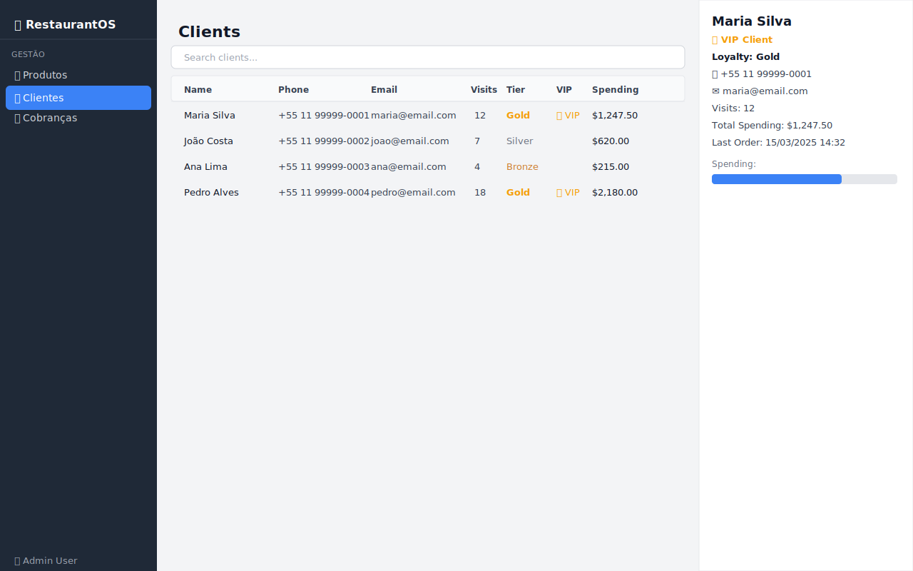

# 07 — Clientes (Clients)

O módulo de Clientes mantém um banco de dados com o histórico e perfil de cada cliente, incluindo sistema de fidelidade e identificação de clientes VIP.

---

## Visão Geral



A tela é dividida em:
- **Área principal** (esquerda/centro) — tabela de clientes com busca
- **Painel lateral** (direita) — detalhes do cliente selecionado

---

## Tabela de Clientes

| Coluna | Descrição |
|--------|-----------|
| **Name** | Nome completo do cliente |
| **Phone** | Número de telefone |
| **Email** | Endereço de e-mail |
| **Visits** | Total de visitas ao restaurante |
| **Tier** | Nível de fidelidade: Bronze, Silver ou Gold |
| **VIP** | ⭐ VIP para clientes especiais |
| **Spending** | Total acumulado gasto no restaurante |

### Exemplo de linha

```
Maria Silva  |  +55 11 99999-0001  |  maria@email.com  |  12  |  Gold  |  ⭐ VIP  |  $1.247,50
```

---

## Buscando Clientes

Use o campo **"Search clients..."** para filtrar em tempo real por:
- Nome (ex: "Maria")
- E-mail (ex: "@gmail")
- Telefone (ex: "99999")

A tabela atualiza instantaneamente a cada caractere digitado.

---

## Painel de Detalhes do Cliente

Clique em qualquer cliente para ver suas informações completas no painel lateral:

```
┌───────────────────────────────┐
│ Maria Silva                   │
│                               │
│ ⭐ VIP Client                 │
│ Loyalty: Gold                 │
│                               │
│ 📞 +55 11 99999-0001          │
│ ✉  maria@email.com            │
│ Visits: 12                    │
│ Total Spending: $1.247,50     │
│ Last Order: 15/03/2025 14:32  │
│                               │
│ Spending:                     │
│ [████████████████████░░░]     │
└───────────────────────────────┘
```

### Campos do Painel

| Campo | Descrição |
|-------|-----------|
| **Nome** | Nome completo com destaque visual |
| **⭐ VIP Client** | Exibido apenas para clientes VIP (badge amarelo) |
| **Loyalty** | Tier de fidelidade com destaque em negrito |
| **📞 Telefone** | Número para contato |
| **✉ E-mail** | Endereço de e-mail |
| **Visits** | Total de visitas registradas |
| **Total Spending** | Valor total gasto no restaurante |
| **Last Order** | Data e hora do último pedido |
| **Barra de gastos** | Barra de progresso comparando o cliente com o de maior gasto |

---

## Sistema de Fidelidade (Loyalty Tiers)

| Tier | Ícone | Critério Típico |
|------|-------|-----------------|
| **Bronze** | — | Novos clientes ou poucos pedidos |
| **Silver** | — | Frequência moderada / gastos intermediários |
| **Gold** | — | Alta frequência e/ou alto valor acumulado |

> O tier é calculado automaticamente com base no histórico de visitas e gastos.

## Clientes VIP ⭐

Clientes marcados como VIP recebem tratamento especial:
- Badge **⭐ VIP** visível na tabela e no painel de detalhes
- Alerta de chegada VIP nas notificações (configurável em [Settings](10-settings.md))

---

## Dicas de Uso

- 💡 Use a barra de busca para localizar clientes rapidamente durante o atendimento
- 💡 Clientes Gold e VIP merecem atenção especial — verifique preferências em visitas anteriores
- 💡 A barra de progresso de gastos ajuda a identificar os clientes mais valiosos para o negócio
- 💡 "Last Order" ajuda a identificar clientes que não visitam o restaurante há muito tempo

---

## 🎥 Vídeo Demonstrativo

📹 [Assista: Gerenciando clientes e fidelidade](../media/videos/07-clients.md)

---

*[← Produtos](06-products.md) | [Cobranças →](08-bills.md)*  
*[← Voltar ao Índice](../index.md)*
