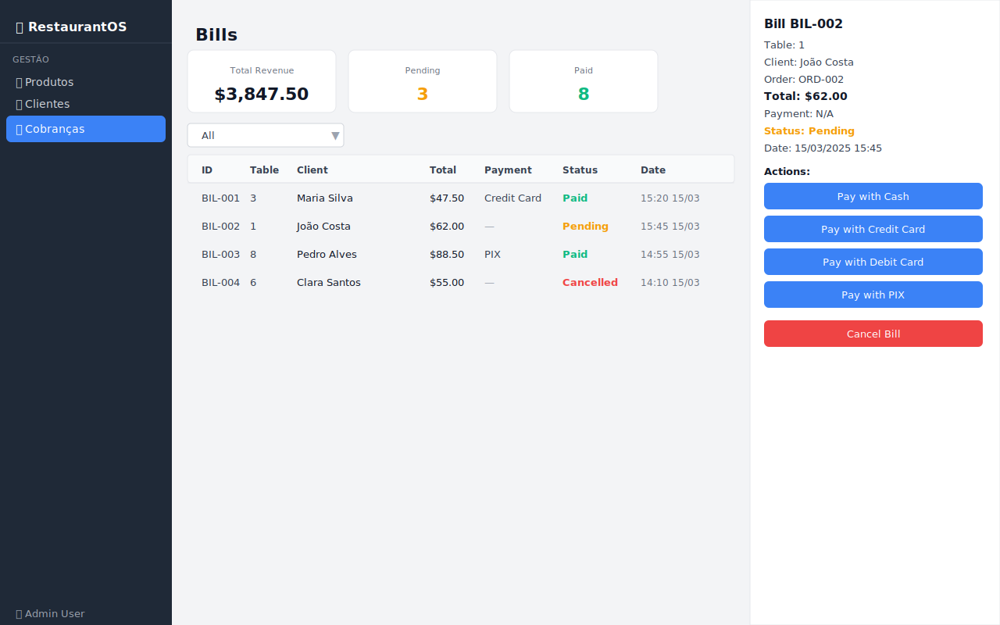

# 08 — Cobranças (Bills)

O módulo de Cobranças gerencia o processo de pagamento dos pedidos concluídos, com suporte a múltiplos métodos de pagamento e resumo financeiro em tempo real.

---

## Visão Geral



A tela é dividida em:
- **Área principal** (esquerda/centro) — resumo financeiro + tabela de cobranças
- **Painel lateral** (direita) — detalhes e ações da cobrança selecionada

---

## Resumo Financeiro

No topo da tela, três cartões exibem o estado geral das cobranças:

```
┌──────────────────┐  ┌──────────────────┐  ┌──────────────────┐
│  Total Revenue   │  │    Pending       │  │      Paid        │
│   $3.847,50      │  │       3          │  │       8          │
└──────────────────┘  └──────────────────┘  └──────────────────┘
```

| Cartão | Descrição |
|--------|-----------|
| **Total Revenue** | Soma de todas as cobranças com status **Pago** |
| **Pending** | Número de cobranças aguardando pagamento |
| **Paid** | Número de cobranças já pagas |

Esses valores são **atualizados automaticamente** ao processar pagamentos.

---

## Tabela de Cobranças

| Coluna | Descrição |
|--------|-----------|
| **ID** | Identificador da cobrança |
| **Table** | Número da mesa |
| **Client** | Nome do cliente |
| **Total** | Valor total da cobrança |
| **Payment** | Método de pagamento utilizado (vazio se pendente) |
| **Status** | Pendente, Pago ou Cancelado |
| **Date** | Data e hora da emissão |

### Filtrar por Status

Use o dropdown de filtro para exibir apenas:
- `Todos` — todas as cobranças
- `Pending` — aguardando pagamento
- `Paid` — já pagas
- `Cancelled` — canceladas

---

## Painel de Detalhes e Ações

Clique em qualquer cobrança para ver os detalhes e, se aplicável, processar o pagamento:

```
┌──────────────────────────────┐
│ Bill BIL-001                 │
│                              │
│ Table: 3                     │
│ Client: Maria Silva          │
│ Order: ORD-001               │
│ Total: $47.50                │
│ Payment: N/A                 │
│ Status: Pending              │
│ Date: 15/03/2025 15:20       │
│                              │
│ Actions:                     │
│ [ Pay with Cash       ]      │
│ [ Pay with Credit Card]      │
│ [ Pay with Debit Card ]      │
│ [ Pay with PIX        ]      │
│                              │
│ [ Cancel Bill         ]      │
└──────────────────────────────┘
```

> Os botões de ação **só aparecem para cobranças com status Pendente**.  
> Cobranças já pagas ou canceladas exibem apenas as informações, sem ações disponíveis.

---

## Processando um Pagamento

1. Clique na cobrança pendente na tabela
2. No painel lateral, escolha o método de pagamento:

| Botão | Método |
|-------|--------|
| **Pay with Cash** | Pagamento em dinheiro |
| **Pay with Credit Card** | Cartão de crédito |
| **Pay with Debit Card** | Cartão de débito |
| **Pay with PIX** | Transferência PIX |

3. O status da cobrança muda imediatamente para **Paid**
4. O método de pagamento é registrado
5. Os cartões de resumo (Total Revenue, Paid) são atualizados automaticamente

---

## Cancelando uma Cobrança

1. Clique na cobrança pendente na tabela
2. No painel lateral, clique em **Cancel Bill** (botão vermelho)
3. O status muda para **Cancelled**

> ⚠️ Cobranças canceladas não contam para o Total Revenue.

---

## Ciclo de Vida de uma Cobrança

As cobranças são **criadas automaticamente** quando um pedido é marcado como **Concluído** na tela de Pedidos:

```
[Pedido Concluído] → Cobrança criada automaticamente (Status: Pending)
       ↓
[Pagamento processado] → Status: Paid → Revenue atualizada
       OU
[Cobrança cancelada] → Status: Cancelled
```

---

## Dicas de Uso

- 💡 Use o filtro **Pending** para ver rapidamente quais mesas precisam pagar
- 💡 O método de pagamento (PIX, cartão, etc.) é registrado para fins de relatório
- 💡 Confira o **Total Revenue** ao final do turno para um balanço rápido
- 💡 Consulte a tela de [Relatórios](09-reports.md) para análises mais detalhadas de receita

---

## 🎥 Vídeo Demonstrativo

📹 [Assista: Processando cobranças e pagamentos](../media/videos/08-bills.md)

---

*[← Clientes](07-clients.md) | [Relatórios →](09-reports.md)*  
*[← Voltar ao Índice](../index.md)*
