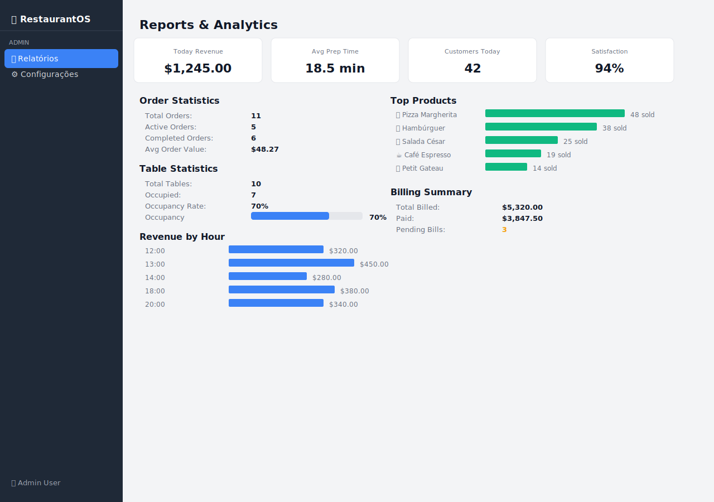

# 09 — Relatórios (Reports)

O módulo de Relatórios consolida indicadores operacionais e financeiros do restaurante em um único painel de analytics.

---

## Visão Geral



---

## Seções do Painel

### 1. KPIs do Dia

Quatro cartões na parte superior exibem os indicadores mais importantes do dia:

```
┌────────────────┐ ┌────────────────┐ ┌────────────────┐ ┌────────────────┐
│ Today Revenue  │ │ Avg Prep Time  │ │Customers Today │ │ Satisfaction   │
│  $1.245,00     │ │   18.5 min     │ │      42        │ │     94%        │
└────────────────┘ └────────────────┘ └────────────────┘ └────────────────┘
```

| KPI | Descrição |
|-----|-----------|
| **Today Revenue** | Receita total do dia |
| **Avg Prep Time** | Tempo médio de preparo dos pedidos (minutos) |
| **Customers Today** | Número de clientes atendidos hoje |
| **Satisfaction** | Índice de satisfação dos clientes (%) |

---

### 2. Estatísticas de Pedidos

| Métrica | Descrição |
|---------|-----------|
| **Total Orders** | Número total de pedidos no sistema |
| **Active Orders** | Pedidos ainda não concluídos |
| **Completed Orders** | Pedidos finalizados |
| **Average Order Value** | Valor médio por pedido (ex: $38.50) |

---

### 3. Estatísticas de Mesas

| Métrica | Descrição |
|---------|-----------|
| **Total Tables** | Número total de mesas cadastradas |
| **Occupied** | Mesas atualmente em uso |
| **Occupancy Rate** | Taxa de ocupação em % |
| **Barra de progresso** | Visualização gráfica da taxa de ocupação |

```
Occupancy  [████████████████░░░░]  80%
```

---

### 4. Receita por Hora

Gráfico de barras horizontais mostrando a receita em cada faixa horária do dia:

```
12:00  [████████████████████████░░░░░░░]  $320.00
13:00  [███████████████████████████████]  $450.00  ← pico
14:00  [████████████████████░░░░░░░░░░]  $280.00
15:00  [████████░░░░░░░░░░░░░░░░░░░░░░]  $120.00
18:00  [██████████████████████░░░░░░░░]  $380.00
19:00  [█████████████████████████████░]  $420.00
20:00  [████████████████████████░░░░░░]  $340.00
21:00  [████████████░░░░░░░░░░░░░░░░░░]  $180.00
```

A barra mais longa corresponde ao horário de maior receita (100% da escala).

---

### 5. Produtos Mais Vendidos

Ranking visual dos produtos mais pedidos:

```
🍕 Pizza Margherita     [████████████████████████████░░]  48 sold
🍔 Hambúrguer Classic   [████████████████████████░░░░░░]  38 sold
🥗 Salada César         [████████████████░░░░░░░░░░░░░░]  25 sold
☕ Café Espresso        [████████████░░░░░░░░░░░░░░░░░░]  19 sold
🍰 Petit Gateau         [████████░░░░░░░░░░░░░░░░░░░░░░]  14 sold
```

Use este ranking para identificar:
- Quais pratos preparar em maior quantidade
- Quais produtos merecem mais destaque no cardápio
- Quais produtos têm baixo desempenho e podem ser revisados

---

### 6. Resumo de Cobranças

| Métrica | Descrição |
|---------|-----------|
| **Total Billed** | Valor total de todas as cobranças emitidas |
| **Paid** | Valor total das cobranças pagas |
| **Pending Bills** | Número de cobranças ainda em aberto |

---

## Casos de Uso

### Reunião de início de turno
1. Abra os Relatórios
2. Consulte os **KPIs do dia** para entender o volume esperado
3. Veja os **Produtos mais vendidos** para preparar ingredientes

### Análise de horário de pico
1. Consulte **Receita por Hora**
2. Identifique os horários de maior movimento
3. Planeje a escala de funcionários conforme os horários de pico

### Balanço ao final do dia
1. Verifique o **Today Revenue** nos KPIs
2. Confira o **Resumo de Cobranças** — certifique-se de que não há cobranças pendentes inesperadas
3. Anote a taxa de ocupação e o valor médio por pedido para comparação futura

---

## Dicas de Uso

- 💡 Os dados de receita por hora são simulados — em produção, seriam obtidos do banco de dados
- 💡 Compare a "Avg Prep Time" entre dias para identificar gargalos na cozinha
- 💡 Um alto número de "Pending Bills" pode indicar problemas no processo de checkout
- 💡 Combine os relatórios com a tela de [Cobranças](08-bills.md) para ação imediata

---

## 🎥 Vídeo Demonstrativo

📹 [Assista: Explorando relatórios e analytics](../media/videos/09-reports.md)

---

*[← Cobranças](08-bills.md) | [Configurações →](10-settings.md)*  
*[← Voltar ao Índice](../index.md)*
