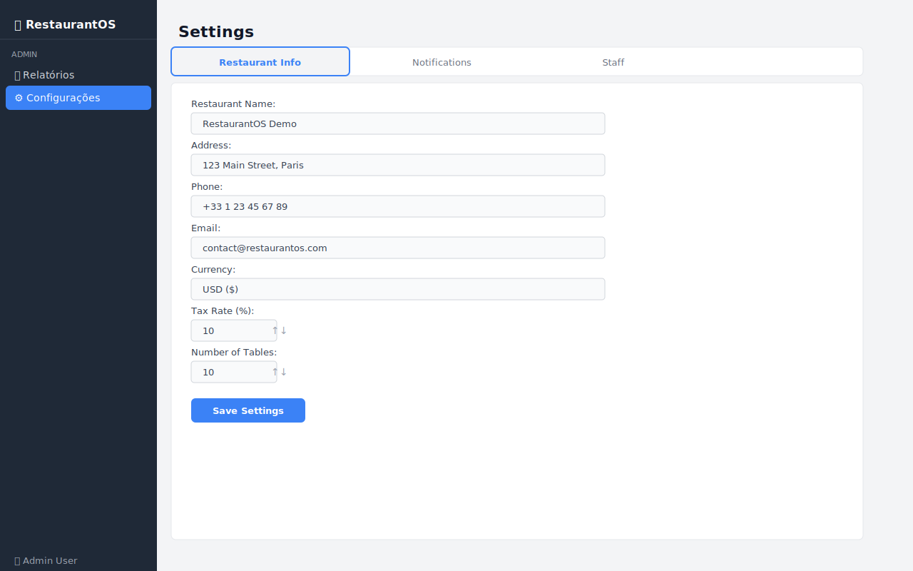

# 10 — Configurações (Settings)

O módulo de Configurações permite personalizar parâmetros do restaurante, preferências de notificação e visualizar a equipe de trabalho.

---

## Visão Geral



A tela é organizada em três **abas** (tabs):

```
┌──────────────────┬──────────────────┬──────────────────┐
│ Restaurant Info  │  Notifications   │     Staff        │
└──────────────────┴──────────────────┴──────────────────┘
```

---

## Aba 1 — Restaurant Info

Configurações gerais do estabelecimento:

```
Restaurant Name:  [ RestaurantOS Demo          ]
Address:          [ 123 Main Street, Paris      ]
Phone:            [ +33 1 23 45 67 89           ]
Email:            [ contact@restaurantos.com    ]
Currency:         [ USD ($)                     ]
Tax Rate (%):     [ 10  ↑↓ ]
Number of Tables: [ 10  ↑↓ ]

[ Save Settings ]
```

| Campo | Descrição | Padrão |
|-------|-----------|--------|
| **Restaurant Name** | Nome exibido no sistema | RestaurantOS Demo |
| **Address** | Endereço físico do restaurante | 123 Main Street, Paris |
| **Phone** | Telefone de contato | +33 1 23 45 67 89 |
| **Email** | E-mail de contato | contact@restaurantos.com |
| **Currency** | Moeda e símbolo usados no sistema | USD ($) |
| **Tax Rate (%)** | Percentual de imposto aplicado (0-100) | 10% |
| **Number of Tables** | Quantidade de mesas do restaurante (1-100) | 10 |

**Como salvar:** Clique em **Save Settings** para confirmar as alterações. Um dialog de confirmação será exibido.

---

## Aba 2 — Notifications

Controle quais notificações o sistema deve emitir:

```
Notification Preferences:

☑ New order notifications
☑ Order ready notifications
☐ Low stock alerts
☑ VIP client arrival
☑ Unpaid bill reminders

Reminder interval (minutes): [ 15 ↑↓ ]

[ Save Notifications ]
```

| Notificação | Descrição | Padrão |
|-------------|-----------|--------|
| **New order notifications** | Alerta quando um novo pedido é criado | ✅ Ativo |
| **Order ready notifications** | Alerta quando um pedido fica pronto na cozinha | ✅ Ativo |
| **Low stock alerts** | Alerta de estoque baixo de produtos | ❌ Inativo |
| **VIP client arrival** | Alerta quando um cliente VIP chega | ✅ Ativo |
| **Unpaid bill reminders** | Lembrete periódico de cobranças não pagas | ✅ Ativo |

**Reminder interval:** Intervalo em minutos para os lembretes de cobrança não paga (1-60 min, padrão: 15 min).

**Como salvar:** Clique em **Save Notifications**. Um dialog de confirmação será exibido.

---

## Aba 3 — Staff

Exibe a lista de funcionários cadastrados:

```
┌─────────────┬───────────┬──────────────┐
│ Name        │ Role      │ Status       │
├─────────────┼───────────┼──────────────┤
│ Jean        │ Waiter    │ Active       │  ← verde
│ Marie       │ Waiter    │ Active       │  ← verde
│ Pierre      │ Chef      │ Active       │  ← verde
│ Sophie      │ Chef      │ Active       │  ← verde
│ Lucas       │ Manager   │ Active       │  ← verde
│ Emma        │ Host      │ Active       │  ← verde
│ Hugo        │ Barista   │ On Break     │  ← amarelo
│ Camille     │ Waiter    │ Off Duty     │  ← vermelho
└─────────────┴───────────┴──────────────┘
```

### Status da Equipe

| Status | Cor | Descrição |
|--------|-----|-----------|
| **Active** | 🟢 Verde | Funcionário em serviço |
| **On Break** | 🟡 Amarelo | Funcionário em pausa |
| **Off Duty** | 🔴 Vermelho | Funcionário fora de serviço |

> A aba Staff é somente leitura na versão atual — para adicionar ou editar funcionários, seria necessário um módulo de RH dedicado.

---

## Dicas de Uso

- 💡 Configure o **Tax Rate** corretamente para que os totais de pedidos e cobranças sejam calculados com precisão
- 💡 Ative **VIP client arrival** para que a equipe seja avisada quando clientes especiais chegarem
- 💡 Defina o **Reminder interval** de cobranças conforme o ritmo do seu restaurante (ex: 15 min em horário de pico, 30 min em horários calmos)
- 💡 A aba **Staff** é útil para o gerente verificar rapidamente quem está de plantão

---

## 🎥 Vídeo Demonstrativo

📹 [Assista: Configurando o RestaurantOS](../media/videos/10-settings.md)

---

*[← Relatórios](09-reports.md)*  
*[← Voltar ao Índice](../index.md)*
